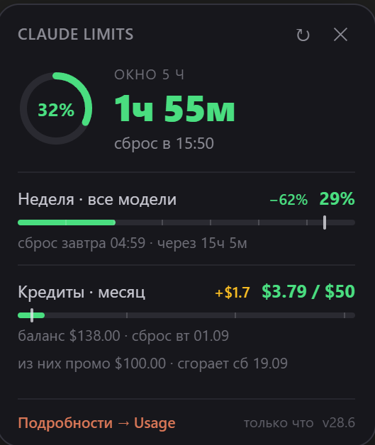

# Claude Limits

Минималистичный виджет расхода лимитов [Claude](https://claude.ai) для Tampermonkey.

Показывает то, ради чего обычно приходится открывать страницу Usage: сколько осталось
до сброса 5-часового окна, как расходуется недельный лимит и месячные кредиты.
Без графиков и без лишних экранов — одна плашка в углу.

## Что умеет

- **5-часовое окно** — крупно: процент, время до сброса, цветовой статус.
- **Недельные лимиты** — общий и по моделям (Opus, Sonnet, Cowork и др.).
  Показываются только те, что реально начали расходоваться.
- **Кредиты за месяц** — потрачено / лимит, баланс, предупреждение о сгорающем промо.
- **Риска равномерного плана** на каждой полоске: видно, идёшь ты с запасом
  или обгоняешь график и рискуешь упереться в лимит до сброса.
- **Прогноз исчерпания** по среднему темпу и по темпу за последние сутки.
- Плашку можно перетащить мышью, позиция запоминается.

## Установка

1. Установи [Tampermonkey](https://www.tampermonkey.net/) для своего браузера.
2. Открой [claude-limits.user.js](https://raw.githubusercontent.com/LeonidLLL/claude-limits-userscript/main/claude-limits.user.js) —
   Tampermonkey сам предложит установку.
3. Обнови вкладку с claude.ai. Плашка появится в правом нижнем углу.

Обновления прилетают автоматически: Tampermonkey раз в сутки проверяет версию
в этом репозитории.

## Как это работает

Скрипт не отправляет никуда никаких данных и не требует ключей.

Он перехватывает запросы, которые claude.ai и так делает к своему API
(`/api/organizations/{id}/usage`), и раз в 5 минут дополнительно запрашивает
их сам — теми же cookie сессии, что уже есть в браузере. Данные о балансе
и промо-кредитах при недоступности API считываются со страницы настроек.

Вся история хранится локально в `localStorage` браузера: 48 часов по сессионному
окну, 8 дней по недельному, 62 дня по тратам. Она нужна для расчёта темпа
расходования и прогнозов.

## Ограничения

- Работает только с интерфейсом claude.ai. При изменении структуры API
  на стороне Anthropic может потребоваться правка.
- Состав недельных под-лимитов зависит от тарифа: у тебя будут видны свои.
- Промо-кредиты определяются эвристически — если их формат в API изменится,
  блок просто не отобразится.

## Разработка

Правишь код — обязательно увеличь номер версии **в двух местах**:
в заголовке `// @version` и в константе `VERSION`. Иначе Tampermonkey
не увидит обновления.

## Лицензия

MIT
